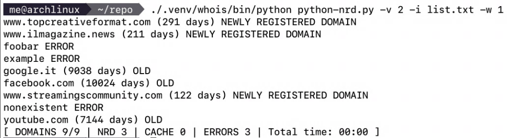

# python-nrd (wip)
Check domain registration dates and verify if they were registered within a specified number of days.

Useful for checking the presence of Newly Registered Domains (NRDs).

## Usage
```
usage: python-nrd.py [options] -i input_file

Check domain registration dates and verify if they were registered within a 
specified number of days. By default, only domains registered within the
specified time frame are printed. Use -v to adjust output verbosity. 

Output format: domain [status]. 

For newly registered domains, the number of days since registration is also
shown. For old domains, the number of days since registration is shown with
the status "OLD". If a cache file is provided, domains found in cache will
be checked without WHOIS request and no sleep time will be applied.

options:
  -h, --help            show this help message and exit
  -i INPUT, --input INPUT
                        
                        File containing the list of domains (one per line)
                        
  -o OUTPUT, --output OUTPUT
                        
                        File to write the output
                        
  -t TIME, --time TIME  
                        Number of days to check registration against 
                        (default: 365)
                        
  -v {0,1,2,3,4}, --verbose {0,1,2,3,4}
                        
                        Set verbosity level (default: 0):
                        
                        0 - Show only newly registered domains
                        1 - Show newly registered domains, errors/invalids,
                            exceptions
                        2 - Show newly registered domains, errors/invalids,
                            exceptions, old domains
                        3 - Show newly registered domains, errors/invalids,
                            exceptions, old domains, registration date
                        4 - Show newly registered domains, errors/invalids,
                            exceptions, old domains, registration date, 
                            exception text
                        
                        The verbosity level set by -v does not affect
                        internal logging from the "whois" library, which
                        may still display errors or warnings.
                        
  -x, --threads         
                        Enable multithreaded checking for faster execution
                        
  -y, --yes             
                        Automatically overwrite the output file if it
                        exists
                        
  -w WAIT, --wait WAIT  
                        Time to wait (in seconds) between WHOIS requests 
                        default: 0)
                        
  -c CACHE, --cache CACHE
                        
                        File to use as cache for WHOIS requests. If a
                        domain is found in cache, it will be checked
                        without waiting.
                        
  -T TLDS, --tlds TLDS  
                        File to use as a list of TLDs to check if a
                        domain is VALID. If the domain does not contain a
                        valid TLD, no WHOIS request will be performed. 
                        The file must contains one TLD per line (case 
                        insensitive). Do not include the dot ('.') 
                        before the TLD. You can check 
                        https://data.iana.org/TLD/tlds-alpha-by-domain.txt
                        for a complete list.

```

## How to install dependencies (Arch Linux example)
```
sudo pacman -S python-pip
python -m venv ./.venv/whois
./.venv/whois/bin/pip install python-whois
```

## Sample output


## Tests
Test to verify the limits imposed by the default whois servers:
1. With command `python-nrd.py -w 1 -t 365 -i list.txt` **successfully performed 16000 queries** (total time 10 hours)
2. With command `python-nrd.py -x -t 365 -i list.txt` network errors started after 500 queries (total time 1 minute)

Currently, setting a sleep time in single-thread mode seems to allow for a high number of WHOIS queries over time without being blocked by the WHOIS servers.

If you perform periodic domain analysis on networks with a large number of users, it is recommended to use the Cache and TLD check systems: this will significantly reduce the analysis time:
* With Command `python-nrd.py -v 1 -i list.txt -w 1 -c cache.txt -T tlds.txt` **successfully performed 32000 queries** (total time 3:50 hours)
