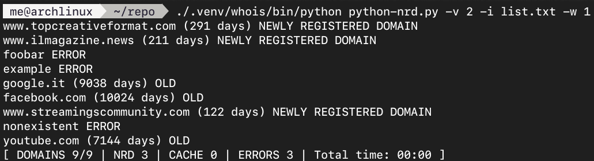

# python-nrd (wip)
Check domain registration dates and verify if they were registered within a specified number of days.

Useful for checking the presence of Newly Registered Domains (NRDs).

## Usage
```
usage: python-nrd.py [options] -i input_file

Check domain registration dates and verify if they were registered within a specified number of days.
By default, only domains registered within the specified time frame are printed. Use -v to adjust output verbosity.

Output format: domain [status]. For newly registered domains, the number of days since registration is also shown.
For old domains, the number of days since registration is shown with the status "OLD".

If a cache file is provided, domains found in cache will be checked without WHOIS request and no sleep time will be applied.

options:
  -h, --help            show this help message and exit
  -i INPUT, --input INPUT
                        File containing the list of domains (one per line)
  -o OUTPUT, --output OUTPUT
                        File to write the output
  -t TIME, --time TIME  Number of days to check registration against (default: 365)
  -v {0,1,2,3}, --verbose {0,1,2,3}

                        Set verbosity level (default: 0):
                        0 - Show only newly registered domains
                        1 - Show newly registered domains, errors, exceptions
                        2 - Show newly registered domains, errors, exceptions, old domains
                        3 - Show newly registered domains, errors, exceptions, old domains, registration date (for debugging)
                        The verbosity level set by -v does not affect internal logging from the "whois" library, which may still display errors or warnings.

  -x, --threads         Enable multithreaded checking for faster execution
  -y, --yes             Automatically overwrite the output file if it exists
  -w WAIT, --wait WAIT  Time to wait (in seconds) between WHOIS requests (default: 0)
  -c CACHE, --cache CACHE
                        File to use as cache for WHOIS requests. If a domain is found in cache, it will be checked without waiting.

```

## How to install dependencies (Arch Linux example)
```
sudo pacman -S python-pip
python -m venv ./.venv/whois
./.venv/whois/bin/pip install python-whois
```

## Sample output


## Tests
Test to verify the limits imposed by the default whois servers:
1. With command `python-nrd.py -w 1 -t 365 -i list.txt` network errors started after 250 queries (total time 4:30 min)
2. With command `python-nrd.py -x -t 365 -i list.txt` network errors started after 80 queries (total time 10 seconds)
3. With command `python-nrd.py -w 5 -t 365 -i list.txt` **successfully performed 4000 queries** (total time 6 hours)

Currently, a 5-second sleep time in single-thread mode seems to allow for a high number of WHOIS queries over time without being blocked by the WHOIS servers.
